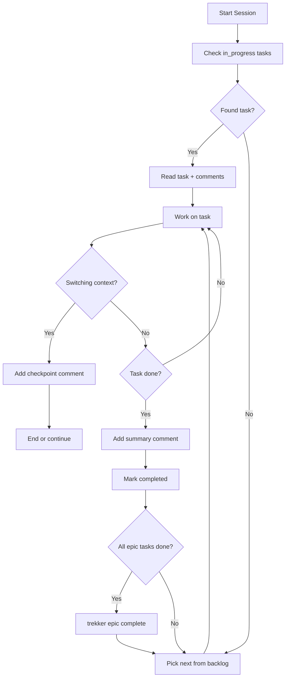

# Trekker Quickstart

Issue tracker for AI agents. Data stored in `.trekker/trekker.db`.

## Setup
trekker init                    # Initialize
trekker wipe -y                 # Remove all data

## Core Rules
1. Set status to `in_progress` when starting, `completed` when done
2. Add summary comment before marking task complete
3. Use `--toon` flag for token-efficient output
4. When epic is done, use `trekker epic complete EPIC-n` to archive all tasks
5. Write detailed descriptions with implementation plans - future agents need this context
6. Comments are your external memory - add summaries before context resets

## Commands

### Epics (features/milestones)
trekker epic create -t "Title" [-d "desc"] [-p 0-5]
trekker epic list [--status <status>]
trekker epic show EPIC-1
trekker epic update EPIC-1 [-t "Title"] [-d "desc"] [-p 0-5] [-s <status>]
trekker epic complete EPIC-1   # Complete and archive all tasks
trekker epic delete EPIC-1

### Tasks
trekker task create -t "Title" [-d "desc"] [-p 0-5] [-e EPIC-1] [--tags "a,b"]
trekker task list [--status <status>] [--epic EPIC-1]
trekker task show TREK-1
trekker task update TREK-1 [-t "Title"] [-d "desc"] [-p 0-5] [-s <status>] [--tags "a,b"] [-e EPIC-1] [--no-epic]
trekker task delete TREK-1

### Subtasks
trekker subtask create TREK-1 -t "Title" [-d "desc"] [-p 0-5]
trekker subtask list TREK-1
trekker subtask update TREK-2 [-t "Title"] [-d "desc"] [-p 0-5] [-s <status>]
trekker subtask delete TREK-2

### Comments (external memory)
trekker comment add TREK-1 -a "agent" -c "content"
trekker comment list TREK-1
trekker comment update CMT-1 -c "new content"
trekker comment delete CMT-1

### Dependencies
trekker dep add TREK-2 TREK-1   # TREK-2 depends on TREK-1
trekker dep remove TREK-2 TREK-1
trekker dep list TREK-1

### Search (full-text across all entities)
trekker search "query" [--type epic,task,subtask,comment] [--status <status>]
trekker search "auth bug" --type task --limit 10

### History (audit log of all changes)
trekker history [--entity TREK-1] [--type task] [--action create,update,delete]
trekker history --since 2025-01-01 --limit 20

### List (unified view of all items)
trekker list [--type epic,task,subtask] [--status <status>] [--priority 0,1]
trekker list --sort priority:asc,created:desc --limit 20

## Status Values
Tasks: todo, in_progress, completed, wont_fix, archived
Epics: todo, in_progress, completed, archived

## Priority Scale
0=critical, 1=high, 2=medium (default), 3=low, 4=backlog, 5=someday

## Agent Workflow

## Session Start
trekker --toon task list --status in_progress
trekker --toon comment list TREK-1

## Working
trekker task update TREK-1 -s in_progress
trekker comment add TREK-1 -a "agent" -c "Analysis: ..."
# ... do work ...
trekker comment add TREK-1 -a "agent" -c "Summary: implemented X in files A, B"
trekker task update TREK-1 -s completed

## Before Context Reset
trekker comment add TREK-1 -a "agent" -c "Checkpoint: done A,B. Next: C. Files: x.ts, y.ts"

## Writing Effective Descriptions

Good descriptions help future agents continue your work:

### Epic descriptions should include:
- Goal and success criteria
- High-level implementation approach
- Key files/modules affected

### Task descriptions should include:
- What needs to be done (specific, actionable)
- Implementation steps
- Files to create/modify
- Acceptance criteria

### Example:
Bad: "Add authentication"
Good: "Implement JWT auth for API.
- Add /auth/login, /auth/logout endpoints
- Create middleware in src/middleware/auth.ts
- Use bcrypt for password hashing
- Protect: /api/users, /api/tasks"